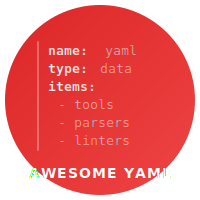

<!--lint disable awesome-heading awesome-github-badge-url awesome-git-repo-age-->

<!-- title -->

# Awesome YAML 

<!-- image -->

<!-- subtitle -->

A curated list of awesome YAML tools, libraries, and resources.

<!-- description -->

YAML is a human-friendly data serialization language used extensively in configuration files, CI/CD pipelines, infrastructure-as-code, and data exchange between services.

## Contents

- [Parsers and Libraries](#parsers-and-libraries)
- [Linters and Validators](#linters-and-validators)
- [Schema Validation](#schema-validation)
- [Editors and IDE Support](#editors-and-ide-support)
- [Converters and Query Tools](#converters-and-query-tools)
- [Templating](#templating)
- [Security](#security)
- [Formatters](#formatters)
- [Diff and Merge](#diff-and-merge)
- [Specifications and Learning](#specifications-and-learning)

## Parsers and Libraries

### Python

- [PyYAML](https://github.com/yaml/pyyaml) - The most widely used YAML 1.1 parser for Python, with optional libyaml C bindings for speed.
- [ruamel.yaml](https://github.com/ruamel/yaml) - YAML 1.2 parser that preserves comments, formatting, and ordering during round-trip operations.
- [StrictYAML](https://github.com/crdoconnor/strictyaml) - Type-safe YAML subset parser that disables dangerous features like arbitrary object instantiation.

### JavaScript and TypeScript

- [js-yaml](https://github.com/nodeca/js-yaml) - Fast, full-featured YAML 1.2 parser and serializer for JavaScript.
- [yaml](https://github.com/eemeli/yaml) - Modern YAML 1.2 library for Node.js with full support for comments and document structure preservation.

### Go

- [go-yaml](https://github.com/go-yaml/yaml) - The standard YAML parser for Go, supports YAML 1.2 with struct tags.
- [goccy/go-yaml](https://github.com/goccy/go-yaml) - High-performance YAML parser for Go with better error messages and path-based queries.

### Java and Kotlin

- [Jackson Dataformat YAML](https://github.com/FasterXML/jackson-dataformats-text) - YAML backend for Jackson, enabling YAML read/write using Jackson's data-binding API.
- [kaml](https://github.com/charleskorn/kaml) - YAML support for kotlinx.serialization with Kotlin multiplatform support.
- [SnakeYAML](https://github.com/snakeyaml/snakeyaml) - Mature YAML 1.1 processor for the JVM, the de facto standard for Java YAML parsing.
- [SnakeYAML Engine](https://github.com/snakeyaml/snakeyaml-engine) - YAML 1.2 processor for Java 8+, the modern successor to SnakeYAML.

### C and C++

- [libyaml](https://github.com/yaml/libyaml) - The reference C library for YAML parsing and emitting, used as backend by many higher-level libraries.
- [rapidyaml](https://github.com/biojppm/rapidyaml) - Blazing fast C++ YAML library, up to 400x faster than PyYAML in benchmarks.
- [yaml-cpp](https://github.com/jbeder/yaml-cpp) - Full-featured YAML 1.2 parser and emitter for C++ with a clean, type-safe API.

### Rust

- [serde-yaml](https://github.com/dtolnay/serde-yaml) - YAML serialization and deserialization framework using Serde, the Rust ecosystem standard.
- [yaml-rust2](https://github.com/Ethiraric/yaml-rust2) - Actively maintained pure Rust YAML 1.2 implementation.

### .NET

- [VYaml](https://github.com/hadashiA/VYaml) - Ultra-fast, low-allocation YAML library for C# optimized for .NET and Unity.
- [YamlDotNet](https://github.com/aaubry/YamlDotNet) - The most popular YAML library for .NET with serialization, deserialization, and low-level parsing.

### Ruby

- [Psych](https://github.com/ruby/psych) - Ruby's built-in YAML parser, a libyaml wrapper included in Ruby's standard library.

### Swift

- [Yams](https://github.com/jpsim/Yams) - Native Swift YAML parser built on top of libyaml.

## Linters and Validators

- [action-yamllint](https://github.com/ibiqlik/action-yamllint) - GitHub Action wrapper for yamllint for easy CI integration.
- [Datree](https://github.com/datreeio/datree) - CLI tool for enforcing Kubernetes best practices and organization policies on YAML manifests.
- [kube-score](https://github.com/zegl/kube-score) - Static analysis of Kubernetes manifests for security and best-practice recommendations.
- [kubeconform](https://github.com/yannh/kubeconform) - Fast Kubernetes manifest validator with CRD support, successor to kubeval.
- [yamllint](https://github.com/adrienverge/yamllint) - Python-based YAML linter checking syntax, key duplication, indentation, line length, and more.

## Schema Validation

- [Ajv](https://github.com/ajv-validator/ajv) - The fastest JSON Schema validator for JavaScript, works with YAML after parsing to JSON.
- [CUE](https://github.com/cue-lang/cue) - Configuration language that can validate YAML and JSON with powerful constraint-based schemas.
- [JSON Schema](https://json-schema.org/) - The standard schema language that also validates YAML since YAML is a superset of JSON.
- [Pydantic](https://github.com/pydantic/pydantic) - Python data validation using type hints, commonly combined with YAML parsers for config validation.
- [SchemaStore](https://github.com/SchemaStore/schemastore) - Largest collection of JSON/YAML schemas for popular config files, integrated in major editors.
- [YAML Language Server](https://github.com/redhat-developer/yaml-language-server) - LSP server with inline JSON Schema validation, auto-complete, and hover for YAML files.

## Editors and IDE Support

- [Emacs lsp-mode YAML](https://emacs-lsp.github.io/lsp-mode/page/lsp-yaml/) - Emacs integration with yaml-language-server via lsp-mode.
- [IntelliJ YAML Plugin](https://plugins.jetbrains.com/plugin/13126-yaml) - Built-in YAML support in JetBrains IDEs with syntax highlighting, formatting, and schema validation.
- [Neovim LSP](https://github.com/neovim/nvim-lspconfig) - Native LSP client for Neovim connecting to yaml-language-server for full YAML support.
- [Sublime Text LSP-yaml](https://github.com/sublimelsp/LSP-yaml) - Sublime Text plugin connecting to yaml-language-server for YAML editing support.
- [VS Code YAML](https://github.com/redhat-developer/vscode-yaml) - Official YAML extension for VS Code with schema validation, auto-complete, and Kubernetes support.

## Converters and Query Tools

- [dasel](https://github.com/TomWright/dasel) - Query and modify YAML, JSON, CSV, TOML, and XML using a uniform selector syntax.
- [jq](https://github.com/jqlang/jq) - The standard JSON processor, often used in YAML pipelines after conversion to JSON.
- [remarshal](https://github.com/dbohdan/remarshal) - Convert between YAML, JSON, TOML, and MessagePack from the command line.
- [spruce](https://github.com/geofffranks/spruce) - YAML merging tool with operators for deep merging, grab, concat, and vault lookups.
- [yj](https://github.com/sclevine/yj) - Lightweight CLI converter between YAML, TOML, JSON, and HCL preserving map order.
- [yq (kislyuk)](https://github.com/kislyuk/yq) - A jq wrapper for YAML/XML/TOML documents leveraging jq's powerful query syntax.
- [yq (mikefarah)](https://github.com/mikefarah/yq) - Portable CLI processor for YAML, JSON, XML, CSV, and TOML files written in Go.

## Templating

- [cdk8s](https://github.com/cdk8s-team/cdk8s) - Define Kubernetes YAML using familiar programming languages like TypeScript, Python, Java, and Go.
- [Dhall](https://github.com/dhall-lang/dhall-lang) - Programmable configuration language with strong typing, imports, and YAML output.
- [Gomplate](https://github.com/hairyhenderson/gomplate) - Flexible Go template renderer with datasource support for generating YAML configs.
- [Helm](https://github.com/helm/helm) - Kubernetes package manager using Go templates to generate YAML manifests.
- [Jsonnet](https://github.com/google/jsonnet) - Data templating language from Google that outputs JSON/YAML, used by Grafana, Tanka, and others.
- [Kustomize](https://github.com/kubernetes-sigs/kustomize) - Template-free YAML customization using overlays and patches, built into kubectl.
- [Tanka](https://github.com/grafana/tanka) - Flexible Kubernetes configuration utility powered by Jsonnet, maintained by Grafana Labs.
- [ytt](https://github.com/carvel-dev/ytt) - YAML-aware templating tool with a Python-like language (Starlark) that operates on YAML structures, not text.

## Security

- [Bandit](https://github.com/PyCQA/bandit) - Python security linter that flags unsafe YAML deserialization calls.
- [Checkov](https://github.com/bridgecrewio/checkov) - Static analysis for IaC (Terraform, Kubernetes YAML, CloudFormation) catching misconfigurations.
- [detect-secrets](https://github.com/Yelp/detect-secrets) - Prevents secrets from entering codebases with YAML allowlisting support.
- [Gitleaks](https://github.com/gitleaks/gitleaks) - Fast secrets scanner for Git repos, detects API keys and passwords embedded in YAML.
- [SafeYAML](https://github.com/dtcooper/python-safe-yaml) - Drop-in replacement for PyYAML that forces safe_load by default to prevent code execution.
- [Semgrep](https://github.com/semgrep/semgrep) - Static analysis tool with built-in rules to detect unsafe `yaml.load()` and deserialization patterns.
- [TruffleHog](https://github.com/trufflesecurity/trufflehog) - Scans repos for leaked secrets and credentials in YAML and other config files.

## Formatters

- [Prettier](https://github.com/prettier/prettier) - Popular multi-language code formatter with built-in YAML support.
- [pretty_yaml](https://github.com/g-plane/pretty_yaml) - Semi-tolerant, configurable YAML formatter with dprint plugin integration.
- [yamlfix](https://github.com/lyz-code/yamlfix) - Python-based YAML fixer that enforces consistent style for comments, quotes, and indentation.
- [yamlfixer](https://github.com/opt-nc/yamlfixer) - Automatically fixes yamllint-reported issues in YAML files.
- [yamlfmt](https://github.com/google/yamlfmt) - Opinionated, extensible YAML formatter from Google with consistent output and easy CI integration.

## Diff and Merge

- [dyff](https://github.com/homeport/dyff) - Structure-aware YAML/JSON diff tool with colored, human-friendly output and kubectl integration.
- [kdiff3](https://kdiff3.sourceforge.net/) - General-purpose three-way diff and merge tool that works well with YAML side-by-side comparison.
- [yamldiff](https://github.com/sahilm/yamldiff) - Simple CLI tool to semantically diff two YAML files.

## Specifications and Learning

- [Learn YAML in Y Minutes](https://learnxinyminutes.com/docs/yaml/) - Quick-start YAML syntax tutorial covering all core features in one page.
- [Real Python YAML Guide](https://realpython.com/python-yaml/) - In-depth Python-focused YAML guide covering PyYAML, ruamel.yaml, and safe practices.
- [YAML 1.2.2 Specification](https://yaml.org/spec/1.2.2/) - The official YAML specification, latest revision from October 2021.
- [YAML Multiline Strings](https://yaml-multiline.info/) - Interactive reference for YAML block scalars and their variants.
- [YAML Playground](https://play.yaml.io/) - Browser-based YAML parser to experiment with YAML syntax and see parsed output in real time.
- [YAML.org](https://yaml.org/) - Official YAML website with spec links, library listings, and community resources.

## Footnotes

Contributions welcome! Read the [contribution guidelines](contributing.md) first.
